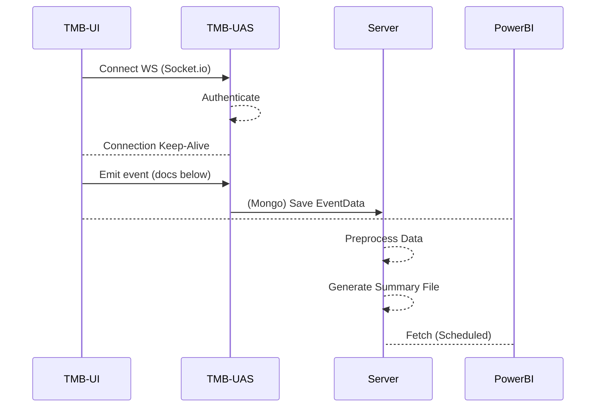

# TMB User Activity Socket

This package (TMB-UAS) accepts user activity sent through a websocket (*Socket.IO*) to collect for user journey analysis and churn statistics.

### Data Flow



## Connection Guide

You can connect and send events from browser or server side as long as successful connection has initiated.

    Host: http://{TMB-UAS IP}:3000

> **NOTE:** Connection may be done from scratch but using **Socket.io** is highly recommended for security and ease of integration.

**Sample SocketIO Browser Integration**

 - The `<script>` import
```html
<script  src="/socket.io/socket.io.js"></script>
```

 - Javascript

```js
  // ES Script / Typescript
  
  // Connect to TMB-UAS
  const TMBUAS_HOST = "http://65.109.203.60:3000";
  const socket = io(TMBUAS_HOST);

  const UASHandleFilterAction = (e) => {
	socket.emit('event', {
	  type: 'filter_action',
	  sessionId: '<String>',
	  eventData: { // free format, send whatever you want
		element: 'language-de',
		action: 'increase',
		value: e.value
	  }
	});
  }
  // Assuming JQuery is used in UI
  $("#filterSlider-language-de").on('change', function(e) {
    UASHandleFilterAction(e);
  });
```


## Events

The structure for analysis will be dynamic. session_start and session_drop are automatically detected as start and exit of customer journey.

| Event Type    | Recommended Trigger | Remarks |
|---------------|---------------------|-------------|
|session_start  | On Socket Connected | *This is currently attached to connection success* |
|filter_action  | Interaction on filter UI (sliders etc) | Can be used with onChange of filter UI Components|
|search         | onClick search button or search endpoint is triggered|Send event of actual search|
|result_stat|*(Optional)* Result data returned|You can send total # of search results with this event|
|view_candidate|Candidate details are viewed||
|call_candidate|onClick call button|can also be clicking on the \<span\> for the candidate phone number| 
|match_candidate|onClick match button| |

## Data Formatting

> **NOTE:** The only strict requirement on this section is the early standardization of event types (ie. session_start, search, match_candidate). Let this section be a guide.

Standard data formatting
```js
socket.emit('event', { 
	type: <String>, // refer to section - Events
	sessionId: <String>, // This can be omitted once we see socket connection ID can sustain
	eventData: <Object | Mixed>
});
```
